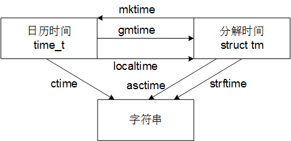

\<ctime\> (time.h)头文件包含了一些获取和操作日期和时间信息的函数，其中定义了一些类型，函数可分为两组：时间处理函数和时间转换函数。

## 数据类型

- clock\_t 

- time\_t: 日历时间

- struct tm: 分解时间

tm结构的成员：

| 成员       | 类型   | 描述        | 范围    |
| -------- | ---- | --------- | ----- |
| tm_sec   | int  | 分钟后边的秒数   | 0-61  |
| tm_min   | int  | 小时后边的分钟   | 0-59  |
| tm_hour  | int  | 从午夜开始计算的时 | 0-23  |
| tm_mday  | int  | 月内的第几天    | 1-31  |
| tm_mon   | int  | 一月以来的约束   | 0-11  |
| tm_year  | int  | 1900以来的年数 | —     |
| tm_wday  | int  | 星期日以来的天数  | 0-6   |
| tm_yday  | int  | 1月1日以来的天数 | 0-365 |
| tm_isdst | int  | 夏令时标志     |       |

## 时间处理函数

```c++
clock_t clock(void);
double difftime(time_t *time1, time_t *time0);
time_t mktime(struct tm *timeptr);
time_t time(time_t *timer);
```

**clock**使用示例：
```c++
#include <stdio.h>
#include <time.h>

int main(void) {
    clock_t start_clock = clock();
    printf("Processor time used: %g sec.\n",
            (clock - start_clock) / (double) CLOCKS_PER_SEC);
    return 0;
}
```

**time**返回当前的日历时间。如果实参不是空指针，那么还会把日历时间储存在实参指向的对象中，既可以用
```c++
cur_time = time(NULL);
```
也可以用
```c++
time(&cur_time);
```
这里的cur_time是time_t类型的变量。

**difftime**使用示例：
```c++
#include <stdio.h>
#include <time.h>

int main(void) {
    time_t start_time = time(NULL);
    printf("Running time: %g sec.\n", difftime(time(NULL), start_time));
    return 0;
}
```

**mktime**把分解时间转换为日历时间，然后返回该日历时间，并且必要时还会调整tm结构成员。

## 时间转换函数

```c++
char *asctime(const struct tm *timeptr);
char *ctime(const time_t *timer);
struct tm *gmtime(const time_t *timer);
struct tm *localtime(const time_t *timer);
size_t strftime(char * restirct s, size_t maxsize,
                const char * restrict format,
                const struct tm * restrict timeptr);
```

## 函数间的关系



## 显示日期和时间

```c++
// ------datetime.c-----
/* Displays the current date and time in three formats */

#include <stdio.h>
#include <time.h>

int main(void) {
    time_t current = time(NULL);
    struct tm *prt;
    char date_time[21];
    int hour;
    char am_or_pm;

    /* Print date and time in default format */
    puts(ctime(&current));

    /* Print date and time, using strftime to format */
    strftime(date_time, sizeof(date_time),
             "%m-%d-%Y %I:%M%p\n", localtime(&current));
    puts(date_time);

    /* Print date and time, using printf to format */
    ptr = localtime(&current);
    hour = ptr->tm_hour;
    if(hour <= 11)
        am_or_pm = 'a';
    else {
        hour -= 12;
        am_or_pm = 'p';
    }
    if (hour == 0)
        hour == 12;
    printf("%.2d-%.2d-%d %2d:%.2d%c\n", ptr->tm_mon + 1, prt->tm_mday,
           ptr->tm_year + 1990, hour, ptr->tm_min, am_or_pm);
    return 0;
}
```
输出如下：
```
Fri May 12 09:46:55 2017

05-12-2017 09:46AM

05-12-2017 9:46a
```
